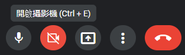
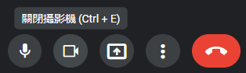
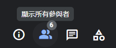
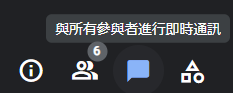
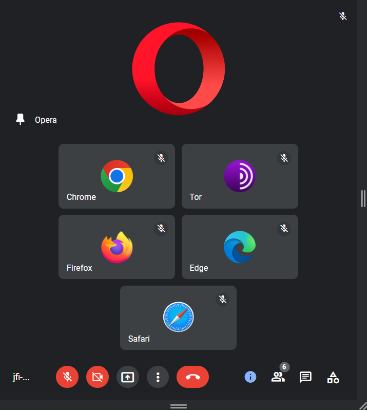

# Web Programming HW#1
---
**Editor**: Yan Sheng Qiu (B10901016)
**Date**: 2022.09.19 

---
## Preface
I tried my best and spent a lot of time (2X hours perhaps), but with limited time I have to give it up now, without attaining perfection.
Hope you enjoy the meeting held between the browsers anyway.

## Cool details / animation / effects 
### Fonts and icons / symbols
Since the original font in the Google meet page,  `Product Sans`, is not an open source font, I used `'Roboto'` from Google Fonts instead.
Also, the icons and symbols are all released on [a Google Fonts page ](https://fonts.google.com/icons) except for one or two svg files that I needed to obtain by checking the elements on the Google Meet page and editing on my own.
### Cursor style
The cursor becomes a pointer (`cursor: pointer;` ) when it's hovering on a button that can be clicked in that situation, and it remains default  (`cursor: default;`) otherwise. 
I prohibited it from becoming a "I" like style when hovering on words that can be selected.
### Selection of words
In the actual Google Meet page, all words *but the meeting code* can't be selected. I used `...::selection { background: transparent; }` to fake it (Actually you can still copy words if you select them in a right way ^w^|||). 
### Description of button function

Upon hovering on any button in the page, a `
` element appears **with smooth opacity transition** introducing the function of that button.
###  Designing buttons using `<input type="checkbox">`
Using the same trick we learned in class (todo) we can use  `<input type="checkbox">`  to implement the buttonso at the bottom. 
If we click on the red button with description `開啟攝影機 (Ctrl + E)`, shown in the picture above, it turns black, with the icon and the description changing.

Only the first two buttons are designed to be able to turn red when checked. Nothing happens when trying to check other buttons.
Also note that when we hover on those buttons the lightness of the background color changes a little bit.
### Designing buttons using `<input type="radio">`

Buttons at the bottom-right corner turns blue upon checking, and one should notice that when checking any other button, the original one turns white.

So I decided to use `<input type="radio">` to implement these buttons. However, embarrassingly, they can't be unchecked. Seemingly it's impossible without introducing JavaScript.
### Fade in/out animation
By setting the transition of opacity of an element we can implement the fade in/out animations.
` {opacity: 1; transition: opacity 0.7s;} `
Note that the three buttons emerging from the member icon undergo **first opacity increase** ** upon hovering on the member block, and they undergo **second opacity increase** upon hovering on themselves directly. Similar opacity decrease works vice versa upon unhovering.
## RWD
Since it's to hard to guess what engineers from Google think and actually implement RWD effects in correct conditions, I tried my best to imitate cases that the window is not distorted too much, and went on my own way in the rest of the cases.
It's worth noticing that the meeting code is shortened with `...` when the footer are too crowded:

