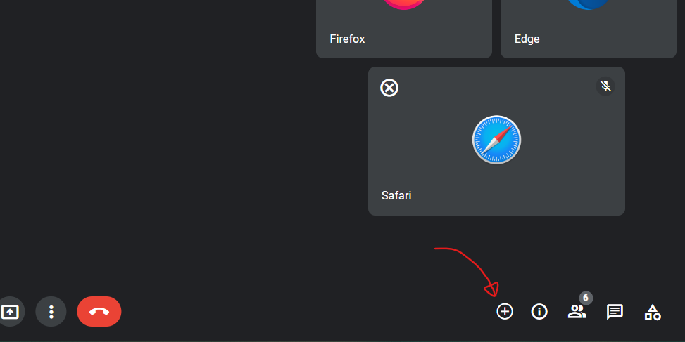
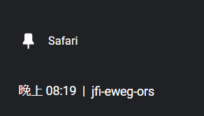
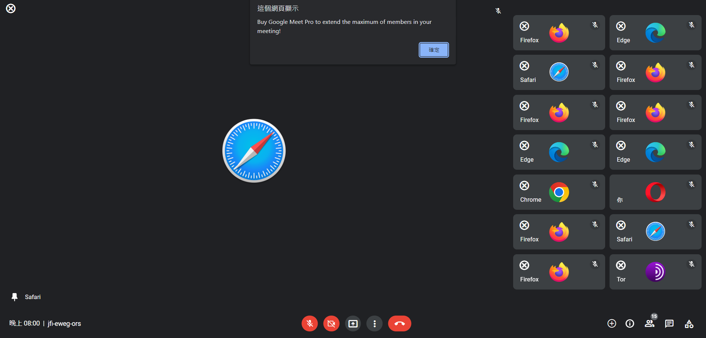
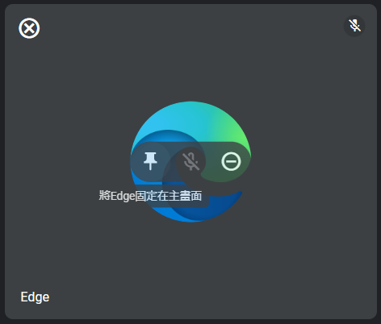
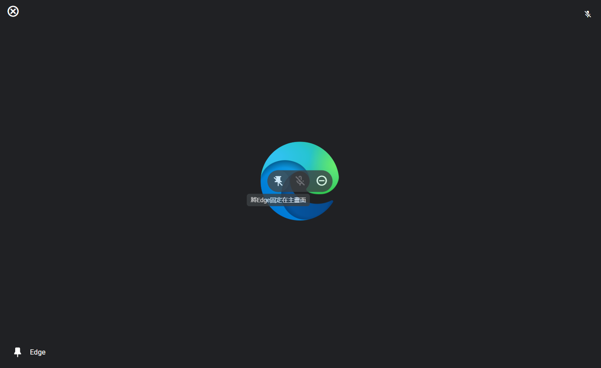

# Web Programming HW#2

---

**Editor**: Yan Sheng Qiu (B10901016)

**Date**: 2022.10.02 

---
## Preface

I *tried* my best and I'm so *tired* now.
This is my first JavaScript work, so please forgive me for the redundant code. Also, I need to confess that I didn't do a great job on HW#1, causing that the codes cannot be more concise. 

Maybe it's possible to rewrite them in JavaScript `function`s, but obviously it's high time that I faced my Electronics homework now QwQ

Anyway, enjoy the meeting of the browsers!

## Basic / Advanced requirements

**All basic/advanced requirements are completed.**

## Things worthy of attention

### Intact HTML and CSS codes

 I didn't modify my HTML and CSS codes in HW#1. All bugs in HW#1 were actually fixed in `main.js`.

### Add-member-button

The button to add member is at the position shown below:

Upon pressing the button, you can see a random browser join in the meeting.

### The clock

The clock on the bottom-left corner shows the current time.

### Layout

The layout should be neat whether someone is anchored or not. The maximum member count is 15, further try to add members gives an alert, reminding the user to buy `Google Meet Pro`.

※*My imploration*:  Please just do not resize the window and neglect the RWD. RWD is not a requirement of HW#2 D:... Unfortunately my RWD properties in HW#1 were very very complicated (I'm new to web programming QwQ) so it might take me 100 hours to work on the RWD layout, and eventually there might be probably 3000 lines in `main.js`... 

## Other cool details / animation / effects 

### Cursor style

The cursor becomes a pointer (`ButtonElement.style.pointer = "pointer";` ) when it's hovering on add-member and remove-member buttons. 

### Icon changes upon anchoring

If a member is not anchored, the the icon shown would be a "pin", while it would be a "unpin" after it is anchored, as shown below.

※*My imploration*: Actually the wrong description shown `「將Edge固定在主畫面」` was a bug in my HW#1, please just ignore it QwQ. The contents of the descriptions were deeply etched in my HTML code and it might take me another 50 hours to modify them all in JavaScript... 

### The member counter shows the correct number!

Although not included in the requirements, I set the number shown on the top-left corner of the "show the member list" button as the correct member count.

## Postscript

If you have any suggestions about the code or the webpage, please write them down in the review! I know my code is so redundant and it surely can be more succinct with more JavaScript techniques ^w^|||
