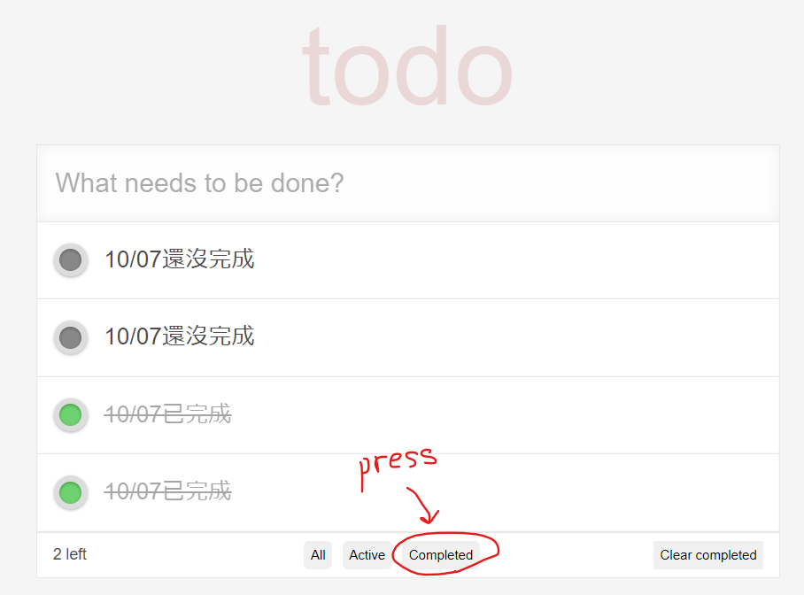
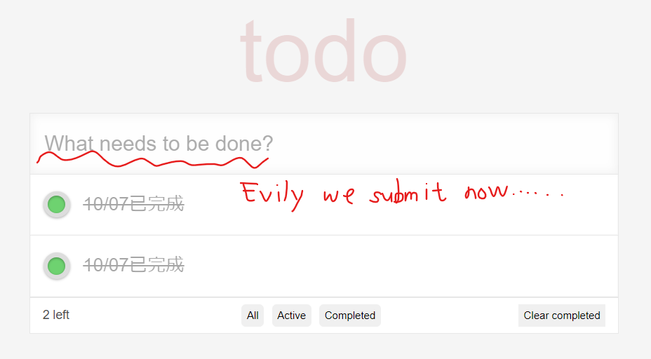
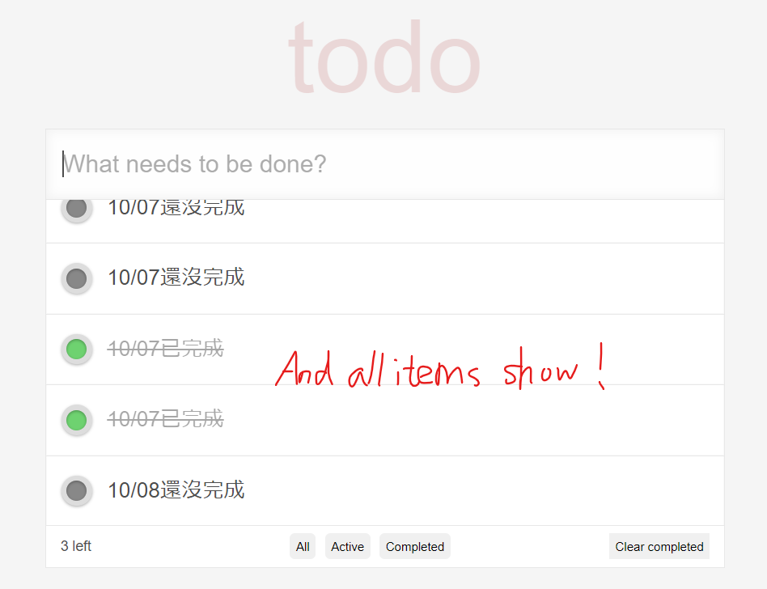

# **Web Programming HW#3**

---

**Editor**: Yan Sheng Qiu (B10901016)

**Date**: 2022.10.10

---
## **Preface**

Maybe I shouldn't have skipped the class.
Or actually I saved 3 hours? I don't know...

Worrying about my first hackathon now.

## **Basic / Advanced requirements**

**All basic / advanced requirements are completed.**

## **Things worthy of attention**

### **Which browser (or OS) are you using?**

Note that the image below doesn't show the same font as the one on the homework description. This probably results from the fact that *Chrome (on Windows?)* doesn't have that font and the webpage uses a fallback font instead, since my friends who use *mac os* didn't encounter these problems.

The annoying scroll bars are of similar problems. One of my frineds pointed out that *Safari* automatically hides useless scroll bars.

I manually modified the `styles.css` given to hide the scroll bars, so you might need to use your mouse wheel to browse the items when there are a lot.

### **Rejecting blank input**

If the user try to create an item with blank detail, the system will just ignore it.

### **Show all items upon submitting**

If we click the `Completed` button first, submitting, defaultly we'll find the list awkward because it shows *the Completed items* and *newly added items*. The newly added items might exclaim *"Why am I here?"* and escape to somewhere.

Since the homework description didn't mention the case, I let all items show upon submitting.

### **Functional components**

Since I'm new to React.js so I only tried to put create the functional components of `<li>` items in the todo list. 

## **Other cool details / animation / effects**

### **Cursor style**

Nothing new. I modified the the cursor style in `styles.css` to let it become a pointer when it's hovering the "x" buttons. 

## **Postscript**

React.js is REALLY mysterious. Hope it'll be less demanding for me in future.
