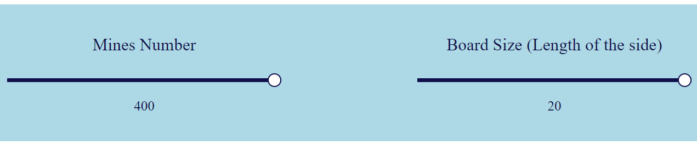
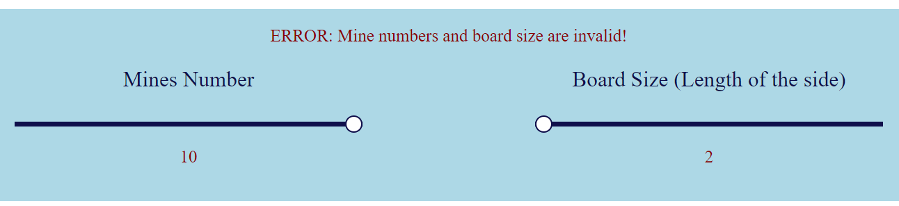

# **Web Programming HW#4**

---

**Editor**: Yan Sheng Qiu (B10901016)

**Date**: 2022.10.16

---
## **Preface**

Although there are still a lot of mystery and unsolvable warnings remained, minesweeper was quite interesting, and at least I learnt more about React.js in the progress of creating the game. 
Seemingly the minesweeper was the topic of the first hackathon last year. **Extremely** Worrying about my first hackathon now.

## **Basic / Advanced requirements**

**All basic / advanced requirements are completed.**

## **Things worthy of attention**

### **Which browser (or OS) are you using?**

Note that the image below doesn't show the same font as the one on the homework description. This probably results from the fact that *Chrome (on Windows?)* doesn't have that font and the webpage uses a fallback font instead, since my friends who use *mac os* didn't encounter these problems.

### **The two `<input type='range'>`s in the homepage**

The maximum of the mines number is set to be `boardSize ** 2`. I naïvely thought that under no circumstances would any mismatch of `mineNum` and `boardSize` occur, but I found a way to trigger the error message before long:

The default value of `mineNum` is 10, don't modify it and minimize `boardSize` and an error occurs. I've attempted to fix it, but soon I found it complicated.

One of my friends told me that setting the maximum interactively was a strange idea. Hope you accept it 😓.

## **Other cool details / animation / effects**

### **You can't press the start button!**

Nothing new. The start button's `opcaity` becomes `0.5` when a mismatch of `mineNum` and `boardSize` occurs.
However, it was difficult to modify the `:hover` selector in CSS. I gave up.

## **Postscript**

There are still lots of important techniques in React.js being beyond my grasp. I know it's recommended to watch tutorial videos (1X hours?) on YouTube but I clearly know I don't have time QwQ.
