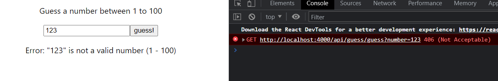

# **Web Programming HW#5**

---

**Editor**: Yan Sheng Qiu (B10901016)

**Date**: 2022.10.29

---
## **Preface**

I messed everything up, sad.

Anyway I finished my HW5. But I don't have time to complete advanced requirements QwQ

## **Basic / Advanced requirements**

**Only basic requirements are completed.**

## **Things worthy of attention**

Nah, nothing special.

### **406 Not acceptable**
The error code can be checked in the console.

