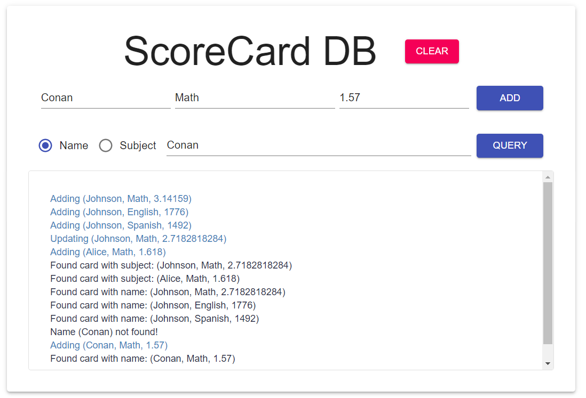
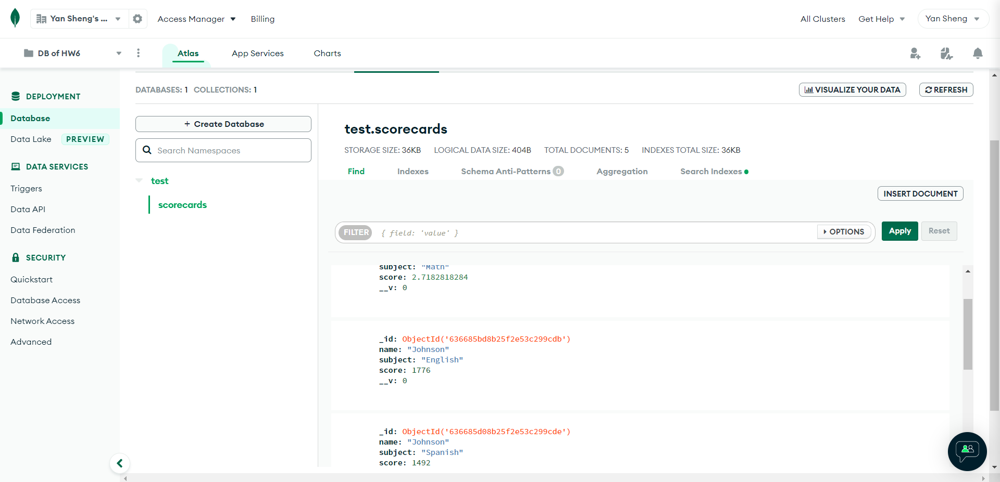
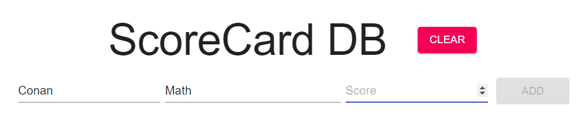

# **Web Programming HW#6**

---

**Editor**: Yan Sheng Qiu (B10901016)

**Date**: 2022.11.05

---
## **Preface**

**TO REVIEWRS: YOU MIGHT NEED TO INSTALL SOME PACKAGES ON YOUR OWN!!!**

We've included a bunch of packages now. That makes me nervous.

When I was reviewing others' HW5, I found that compile errors would occur if I didn't `yarn add axios`. I wished I wasn't going to get `dead`s.

Problems here. What should I do when I'm reviewing HW6? How can I deal with mongoDB? Will I need to install packages on my own? 

BTW I gave up completing the advanced requirements since it seemed like I needed to install more packages for more material-UI objects (like `tabs` or `tables` maybe).

## **Basic / Advanced requirements**

**Only basic requirements are completed.**

## **Things worthy of attention**

Nah, nothing special.

### **`Not found` are not regarded as error messages here**

I guess `not found` messages were designed to be error messages (red), but I think they can't be regarded as error messages because the users didn't do something "ilegal". They just wanted to check if there were data of subject, for example, Japanese, and unfortunately there weren't. 

### **You can't add when the score is blank!**

Why can one add data when with the score blank? It's somewhat ridiculous, and I fixed it.

