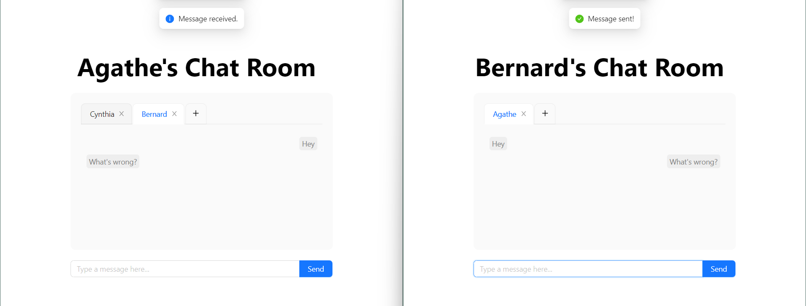
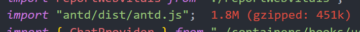
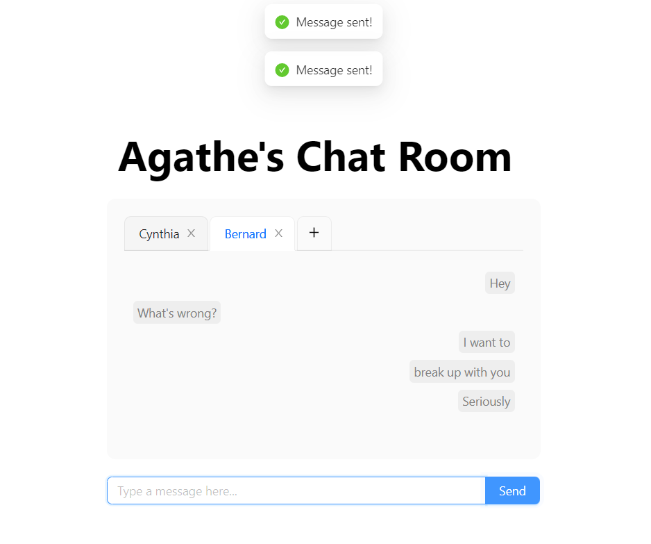

# **Web Programming HW#7**

---

**Editor**: Yan Sheng Qiu

**Date**: 2022.11.27

---
## **Preface**

There are still trivial bugs...hope you don't mind. I've done my best to find all the bugs and fix them QwQ.
## **Basic / Advanced requirements**

**Only basic requirements are completed.**

## **Things worthy of attention**

Nah, nothing special.

### **Imporved autoscrolling**

When switching to a chatbox or sending a message in a chatbox, the page automatically scrolls to the bottom. I wasted a lot of time designing this so I want to mention it here ^w^|||.

### **New version of `antd` included.**

Instead of `antd.css` or `antd.min.css` I included `antd.js` in `index.js`. Seems like a whole new version of `antd` module has been released recent weeks. All works fine on my computer. Hope they work fine on yours too...

### **Multiple status messages appear together?!**

There are several status messages I added on my own.

+ **(Info) 'New Chatbox created!'**
  
  When one creates a new chatbox it appears. 

+ **(Info) 'Messages loaded.'**

  When one switches to a chatbox it appears.

+ **(Info) 'Message received.'**

  Appears when one receives a message.

But I don't know why usually multiple status messages appear together. Experiments show that **the one at the bottom is always the correct one**, and others are seemingly random.

Someone(?) said `react` automatically renders twice under dev mode for some reason, and I think that renders this annoying bug.

It's exhausting (and meaningless) to fix this ... do not give me dead...QwQ

